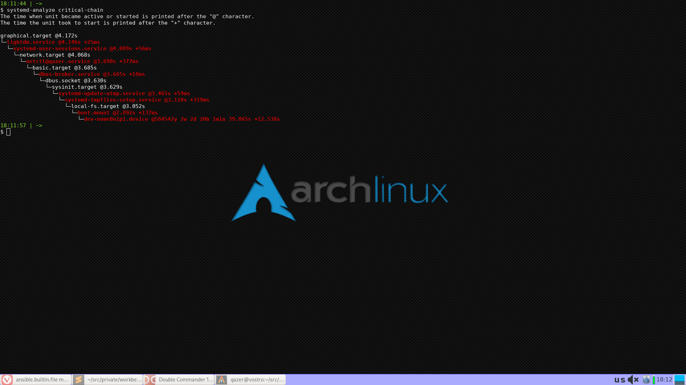

openbox-qaztom
==============

A custom Openbox-based DE striving to include only lightweight components with no dependencies
on heavy DEs (though Xfce components are still used).

WM: Openbox.
Desktop: Tilda console + wallpaper + Xfce panel.

Note the [keymap](docs/keymap.md) description.

Requirements
------------

None.

Role Variables
--------------

* `user_config` &mdash; user configuration.
    * `name` &mdash; name of the target user.
    * `home_dir` &mdash; target user's home.
* `install_packages` &mdash; if set to `false`, skips the package installation.
* `system` &mdash; a dict with target system properties.
    * `hidpi` &mdash; whether to use HiDPI configuration or not.
    * `gui` &mdash; GUI settings.
        * `dm` &mdash display manager used in this system.
* `wallpaper` &mdash; path to wallpaper image (if required).
* `xfce` &mdash; xfce settings.
    * `panel` &mdash; xfce-panel settings.
        * `x`, `y` &mdash panel coordinates (`x` is the screen center, `y` is the panel top coordinate).

Dependencies
------------

None.

License
-------

WTFPL
