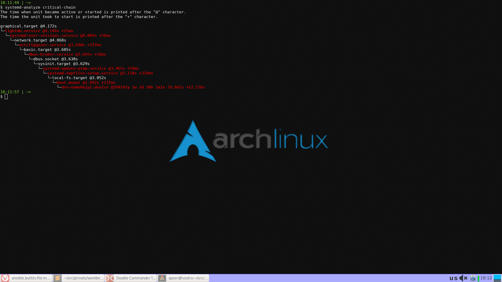

openbox_-_qaztom
==============

A custom Openbox-based DE striving to include only lightweight components with no dependencies
on heavy DEs (though Xfce components are still used).

WM: Openbox.
Desktop: Tilda console + wallpaper + Xfce panel.

Note the [keymap](docs/keymap.md) description.

Role Variables
--------------

Custom `de_config` variables:
* `wallpaper` &mdash; path to wallpaper image (if required).
* `xfce_panel` &mdash; xfce-panel settings.
    * `x` &mdash; screen center;
    * `y` &mdash; panel top coordinate.
